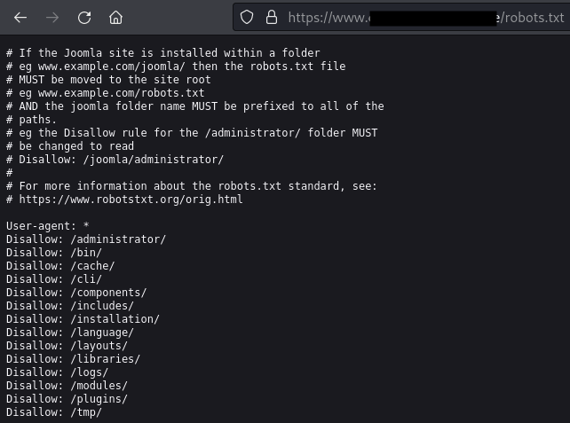
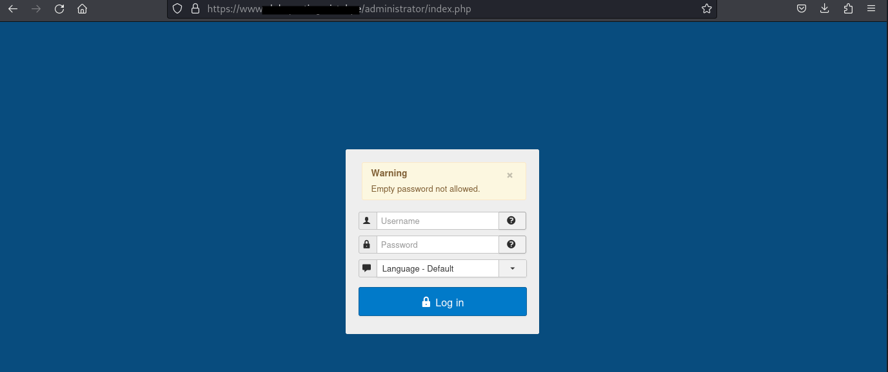
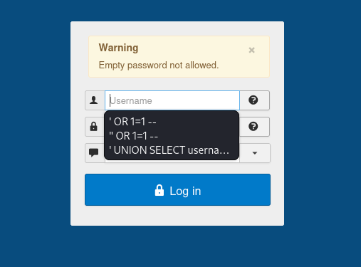
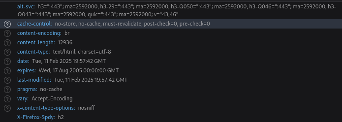

# Análisis de Vulnerabilidades en un Sitio Web

Este documento describe el análisis de seguridad realizado a un sitio web utilizando herramientas como **Nikto**, **OWASP ZAP**, y técnicas de inyección SQL. Se ha realizado en un entorno de pruebas utilizando **Kali Linux**.

## **Información General del Sitio Web 📝 **
- **Tipo de Sitio Web:** Joomla  
- **Tecnologías utilizadas:** PHP, MySQL  
- **Objetivo del Análisis:** Identificar vulnerabilidades de seguridad y proponer soluciones efectivas.  
- **Herramientas utilizadas:**  
  - **Nikto** (escaneo de vulnerabilidades web)  
  - **OWASP ZAP** (detección de fallos de seguridad en aplicaciones web)  
  - **Kali Linux** (plataforma de pruebas de penetración)  
  - **Técnicas de SQL Injection** (pruebas de inyección SQL manuales)  

---

## Vulnerabilidades Identificadas

### **1. Exposición del archivo robots.txt**
- **Descripción:**  
  - El archivo `robots.txt` revela rutas sensibles como `/administrator/`, lo que facilita la identificación de áreas críticas del sitio.
- **Impacto:**  
  - Los atacantes pueden conocer directorios importantes y lanzar ataques dirigidos.
- **Solución:**  
  - Evitar incluir rutas sensibles en `robots.txt` o restringir accesos mediante `.htaccess`.

#### **Evidencia:**

---

### **2. Acceso público al panel de administración (/administrator/)**  
- **Descripción:**  
  - La URL `/administrator/` devuelve un código HTTP 200, lo que indica que el panel está accesible.
- **Impacto:**  
  - Facilita ataques de fuerza bruta y explotación de credenciales débiles.
- **Solución:**  
  - Implementar autenticación multifactor.
  - Restringir acceso por IP o VPN.
  - Configurar redirecciones o respuestas HTTP 403 para evitar su indexación.

#### **Evidencia:**

---

### **3. Inyección SQL detectada en formularios**  
- **Descripción:**  
  - Mediante pruebas manuales y automatizadas, se encontró que ciertos parámetros en las consultas SQL no están correctamente validados.
- **Impacto:**  
  - Posibilidad de robo o modificación de la base de datos.
- **Solución:**  
  - Usar consultas preparadas (Prepared Statements).
  - Validar y sanitizar entradas del usuario.
  - Implementar un Web Application Firewall (WAF).

#### **Evidencia:**

---

### **4. Falta de encabezados de seguridad en respuestas HTTP**  
- **Descripción:**  
  - OWASP ZAP identificó que el servidor no envía encabezados como `X-Frame-Options` o `Content-Security-Policy`.
- **Impacto:**  
  - Aumenta la exposición a ataques como **Clickjacking** y **Cross-Site Scripting (XSS)**.
- **Solución:**  
  - Configurar los encabezados de seguridad en el servidor web.

#### **Evidencia:**

---

## Reporte Completo 📑

- [Resultados Completo](./resultados.txt)

--  

## **3. Recomendaciones Generales**  
1. **Actualizar Joomla y plugins** regularmente para corregir vulnerabilidades conocidas.  
2. **Aplicar políticas de contraseñas seguras** y doble factor de autenticación.  
3. **Configurar reglas en el firewall** para restringir accesos sospechosos.  
4. **Realizar auditorías periódicas** para detectar nuevas vulnerabilidades.  

---
## **4. Conclusiones**  
Este análisis permitió identificar vulnerabilidades críticas que podrían comprometer el sitio web. Implementando las soluciones propuestas, se puede fortalecer la seguridad y reducir el riesgo de ataques.  

--

## Referencias📑

- [OWASP Top 10](https://owasp.org/www-project-top-ten/)
- [OWASP SQL Injection Prevention Cheat Sheet](https://cheatsheetseries.owasp.org/cheatsheets/SQL_Injection_Prevention_Cheat_Sheet.html)
- [OWASP XSS Prevention Cheat Sheet](https://cheatsheetseries.owasp.org/cheatsheets/XSS_Prevention_Cheat_Sheet.html)
- [OWASP CSRF Prevention Cheat Sheet](https://cheatsheetseries.owasp.org/cheatsheets/Cross_Site_Request_Forgery_Prevention_Cheat_Sheet.html)

## Autor 👨‍💻

**[Jorge Balarezo Cardenas]**  
- LinkedIn: [Enlace a mi perfil](https://www.linkedin.com/in/jorge-balarezo-cardenas/)  
- Email: [jbalarezocarden@gmail.com]

--
